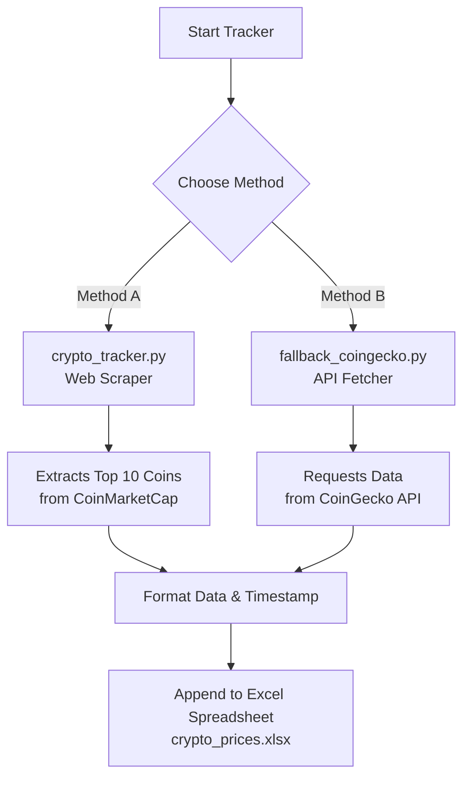

# 🪙 Cryptocurrency Price Tracker 📈

[](https://www.python.org/)
[](https://www.selenium.dev/)
[](https://pandas.pydata.org/)
[](https://products.office.com/excel)

A beautiful, beginner-friendly Python suite that automatically tracks the prices, 24-hour change, and market cap of the **Top 10 Cryptocurrencies** directly from the web and compiles them into a premium Microsoft Excel spreadsheet (`crypto_prices.xlsx`) complete with historical timestamps.

---

## ⚡ Project Overview

This project includes **two independent tracking methods** designed to keep your records updated:



### 📋 Method Comparison

| Feature | 🕸️ Method A (Web Scraper) | 🔌 Method B (API Fallback) |
| :--- | :--- | :--- |
| **Source** | [CoinMarketCap Website](https://coinmarketcap.com) | [CoinGecko API](https://www.coingecko.com) |
| **Technology** | Selenium (Headless Chrome) | Requests (JSON API query) |
| **Setup Time** | ~10-15 seconds (initial browser driver setup) | < 1 second |
| **Fragility** | Moderate (may need updates if page structure changes) | Extremely Low (immune to design updates) |
| **No-Driver Needed** | ❌ Requires Chrome installed |  No requirements |
| **Output File** | `crypto_prices.xlsx` (Excel) | `crypto_prices.xlsx` (Excel) |

---

## 🚀 1. Installation & Setup

Before running the tracker, you need to install the required Python packages. Open your terminal or Command Prompt and run the command below:

```bash
python -m pip install selenium pandas webdriver-manager requests openpyxl
```

> [!TIP]
> If your system does not recognize `python -m`, you can try using `pip` directly:
> ```bash
> pip install selenium pandas webdriver-manager requests openpyxl
> ```

---

## 🕸️ 2. Method A: Selenium Scraper (`crypto_tracker.py`)

This script launches an invisible, automated Chrome browser in the background, loads CoinMarketCap, extracts the top 10 coin rows, formats their values, and appends them to your Excel spreadsheet.

### 💻 How to Run:
```bash
python crypto_tracker.py
```

### 🔍 How the Code Works (Plain English)
* **Web Browser Automation:** It uses Selenium with Chrome options set to `--headless=new`, which makes the browser run in the background without opening a window on your desktop.
* **Smart Data Extraction:** It locates the main coin table and loops through the rows. It looks at the Rank column: if the rank is a number between 1 and 10, it extracts the details (skipping advertisements, headers, and sponsored items).
* **Caret Direction Logic:** CoinMarketCap does not put negative signs (`-`) in front of falling coins. Instead, it uses caret icons. The script inspects the cell HTML: if it contains `icon-Caret-down`, it adds a `-` prefix; if it contains `icon-Caret-up`, it adds a `+` prefix.
* **Saving (Appending) to Excel:** It checks if `crypto_prices.xlsx` already exists.
  * If it exists: it reads the current sheet, combines it with the 10 new rows, and saves it.
  * If not: it creates a new Excel file directly.

---

## 🔌 3. Method B: API Fallback (`fallback_coingecko.py`)

This script bypasses web page structures entirely by requesting raw numbers directly from the CoinGecko public API database. It does not need a browser or drivers to run, making it fast and robust.

### 💻 How to Run:
```bash
python fallback_coingecko.py
```

### 🔍 How the Code Works (Plain English)
* **Direct Network Request:** It uses Python's `requests` library to query the official CoinGecko market database.
* **SSL Certification Bypass:** Some networks or antivirus programs block SSL handshakes. The script uses `verify=False` and suppresses warnings so that the API call works under any network condition.
* **Elegant Formatter:** It converts raw numeric values into beautiful text labels matching CoinMarketCap formats (e.g. `1225571269256` becomes `$1.23T`, and positive/negative percentages get clear signs).
* **Appending:** It saves the 10 coins into the same `crypto_prices.xlsx` Excel file, appending them to your historical database.

---

## 🛠️ 4. Selector Troubleshooting (When Pages Change)

Web scraping is a wonderful skill, but websites change their designs over time. If the Web Scraper stops finding data, follow these steps to update your code:

### Step A: Identify the Issue
If the scraper breaks, you will see an error in the terminal:
> `An error occurred during scraping: Message: no such element...`

### Step B: Inspect the HTML
1. Open Google Chrome and go to [CoinMarketCap](https://coinmarketcap.com).
2. Right-click on the data you want to scrape (like the coin price or the table body) and choose **Inspect** to open Chrome Developer Tools.

### Step C: Update Selectors in the Code
In [crypto_tracker.py](file:///c:/main%20file/my%20work/INT-JS-PROJECTS/MINI%20PROJECT%20ON%20COIN%20RATE/crypto_tracker.py):
* **Main Table:** Look for `table.cmc-table`. If the class changes, edit line 74:
  ```python
  wait_helper.until(EC.presence_of_element_located((By.CSS_SELECTOR, "table.NEW-CLASS")))
  ```
* **Table Columns:** If the column orders are shuffled, adjust the cell indices inside the row loop:
  * `cells[1]` is Rank.
  * `cells[2]` is Name/Symbol.
  * `cells[3]` is Price.
  * `cells[4]` is 24h Change.
  * `cells[7]` is Market Cap.
* **Caret Class:** If they stop using `icon-Caret-down`, inspect the HTML of a red percentage cell, find the class name of the caret span, and update:
  ```python
  if "new-down-icon-class" in change_html:
  ```

---

## 📊 5. Excel Spreadsheet Structure

The generated `crypto_prices.xlsx` workbook contains the following columns ordered cleanly for inspection:

| Rank | Name | Symbol | Price | 24h Change | Market Cap | Timestamp |
| :---: | :--- | :---: | :--- | :---: | :--- | :--- |
| `1` | Bitcoin | BTC | `$61,087.89` | `-0.67%` | `$1.23T` | `2026-06-10 14:50:55` |
| `2` | Ethereum | ETH | `$1,616.63` | `-1.02%` | `$195.65B` | `2026-06-10 14:50:55` |

*Every time you run either script, 10 new rows are appended to the bottom, allowing you to track prices over time.*

---

Enjoy your Cryptocurrency Price Tracker! 🚀
